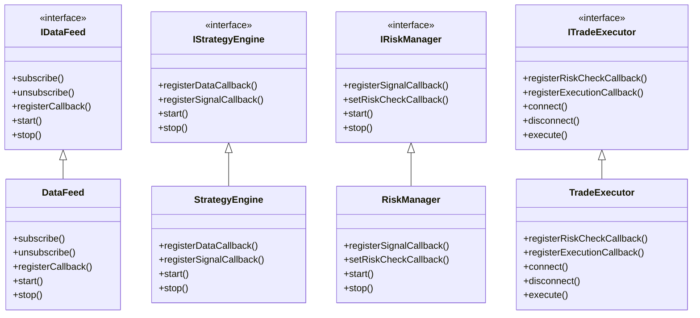
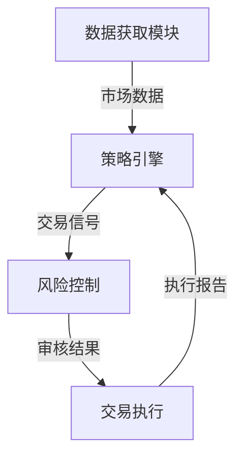
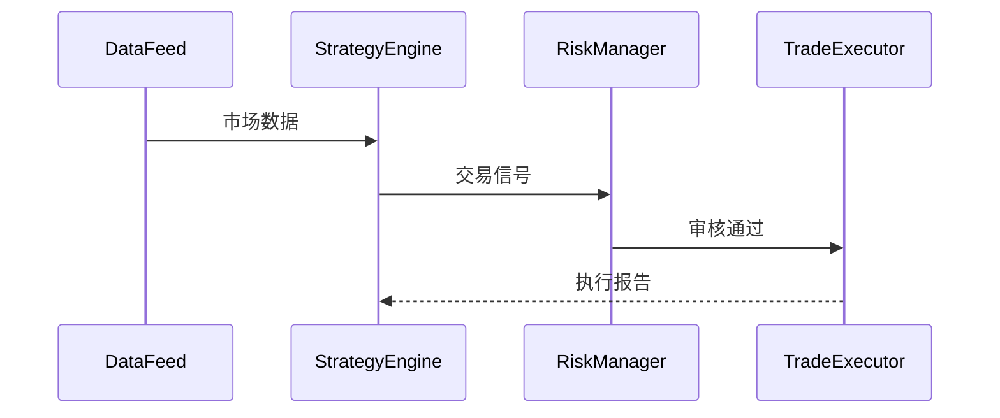

# 量化交易系统架构设计

## 1. 类关系图 (UML)

## 2. 系统框架图

## 3. 序列图示例

## 4. 主要接口说明

- **IDataFeed**: 数据获取接口
- **IStrategyEngine**: 策略引擎接口
- **IRiskManager**: 风险管理接口
- **ITradeExecutor**: 交易执行接口

## 5. 回调函数说明

1. `onMarketData`: 处理市场数据
2. `onSignal`: 处理交易信号
3. `onRiskCheck`: 风险检查
4. `onExecution`: 执行报告处理